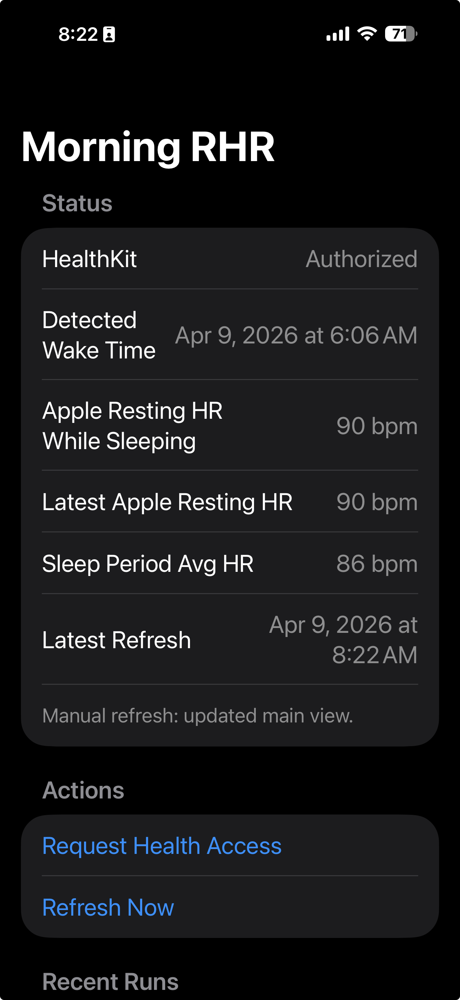

# rhrSample

This project is a small iOS experiment around resting heart rate during sleep.

The goal was to compare two morning metrics pulled from Apple Health:

- Apple HealthKit's `restingHeartRate`
- The average of all `heartRate` samples collected during the user's most recent sleep period

## What It Does

The app:

- Requests read access to `sleepAnalysis`, `restingHeartRate`, and `heartRate`
- Detects the user's latest sleep end time from HealthKit sleep samples
- Treats the most recent asleep interval group as the overnight sleep period
- Pulls the latest Apple `restingHeartRate`
- Pulls all `heartRate` samples from the sleep period and calculates their average
- Attempts hourly background refreshes after wake-up until 10:00 AM local time
- Displays the latest results on the main app screen

## Why

This was built as an experiment to see how Apple's own resting heart rate value compares with a simpler sleep-window heart-rate average.

It is not intended to be a medical tool or a production-grade background monitoring app.

## Important iOS Constraints

- Background refresh on iOS is best-effort. The app can request roughly hourly execution, but iOS does not guarantee exact hourly runs.
- HealthKit availability depends on the device, permissions, and whether relevant sleep and heart-rate data exists.
- The current implementation uses the latest detected sleep session from the last 24 hours and groups nearby asleep samples into one overnight session.

## Project Structure

- `project.yml`: XcodeGen project definition
- `rhrApp/HealthKitManager.swift`: HealthKit queries and metric calculation
- `rhrApp/AppState.swift`: app state, morning gating, persistence, and run history
- `rhrApp/BackgroundTaskManager.swift`: background refresh registration and scheduling
- `rhrApp/ContentView.swift`: main in-app dashboard
- `RHR-Email.md`: original logic notes that informed the sleep-window query approach

## Running It

1. Open the generated Xcode project.
2. Set a real bundle identifier and signing team.
3. Run on a physical iPhone with Health data.
4. Grant HealthKit permissions when prompted.

This project is mainly useful as a prototype for exploring RHR-related logic, not as a finished app.
